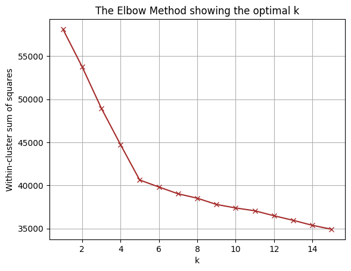
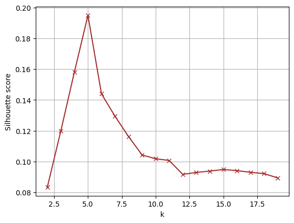
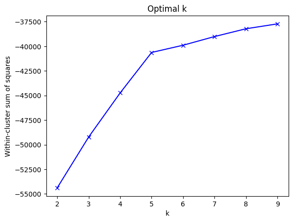
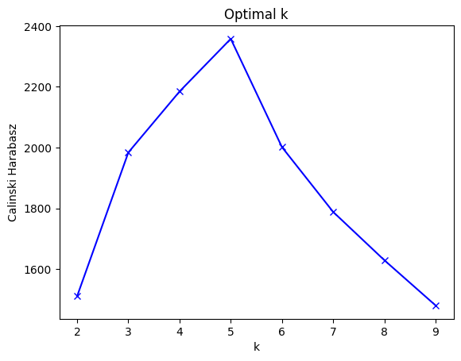
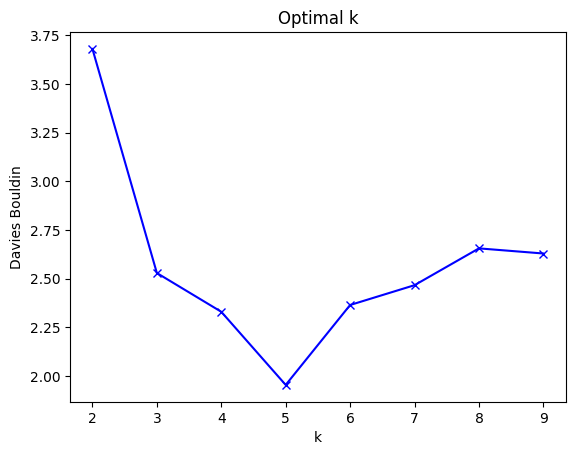
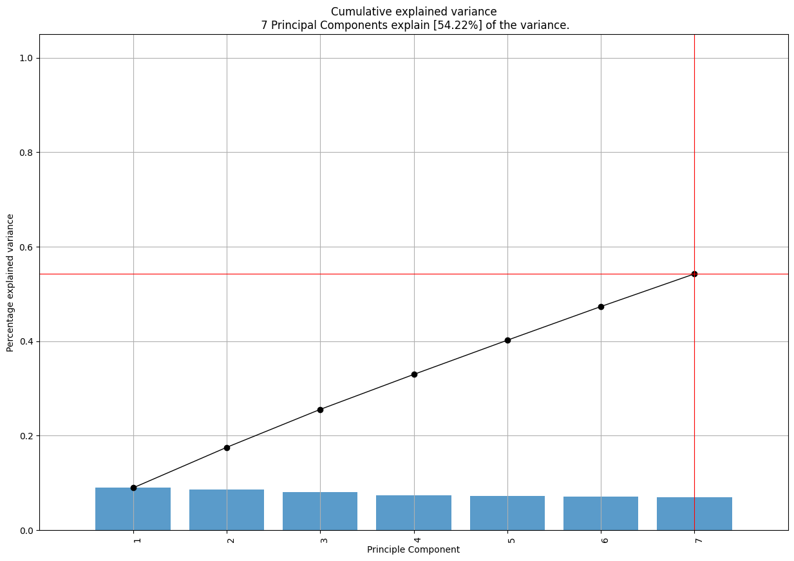
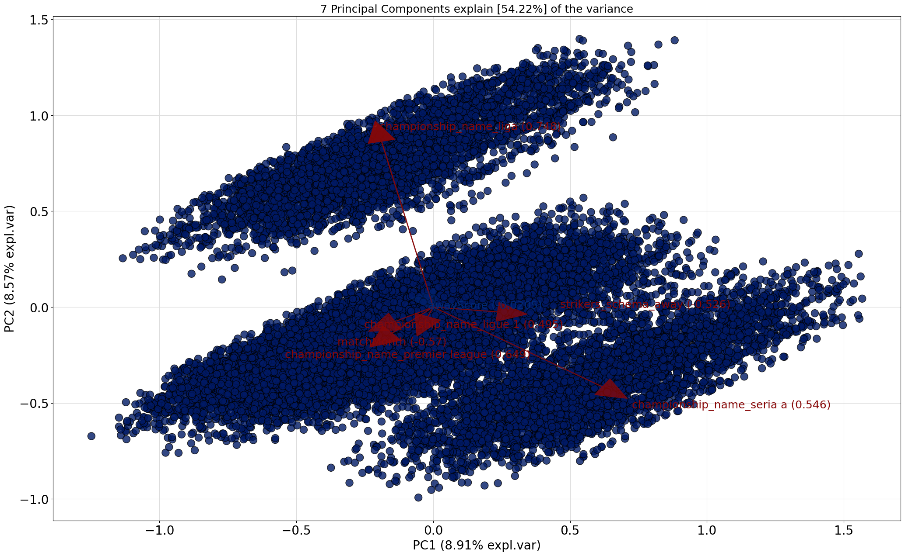

## Feedback - feature engineering
+ (odp:mamy tak dużo kolumn, że musieliśmy sporo pousuwać, zostawiamy przy treshold 0.7) 0.7 to dość niski threshold przy usuwaniu skorelowanych kolumn
+ (odp: wydaje nam się, że tak, ponieważ, sprawdziliśmy, że drużyn jest naprawdę dużo, więc niewiele nam one mówią + nie ma możliwości dobrego zamienienia ich na kolumny numeryczne tak, aby nie powiększyć ramki do niesamowicie wielkich rozmiarów. Poza tym nie wydaje nam się to niezbędne do stwierdzenia, czy gracz zagrał dobrze w daynm meczu, więc zostawiamy usunięte) czy usunięcie nazwy druzyny to n apewno dobry pomysł?
+ 
+ 
+ 
+ 
+ 
+ 
+ 
wyniki podobne
