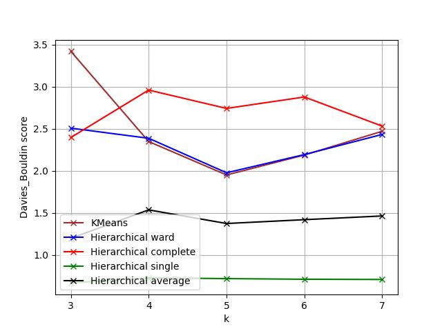
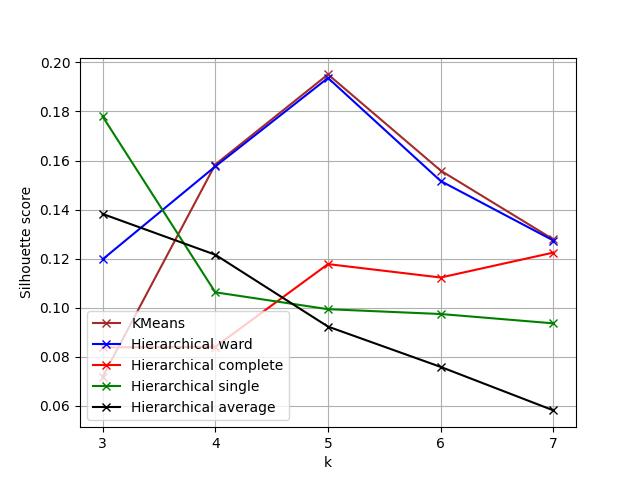
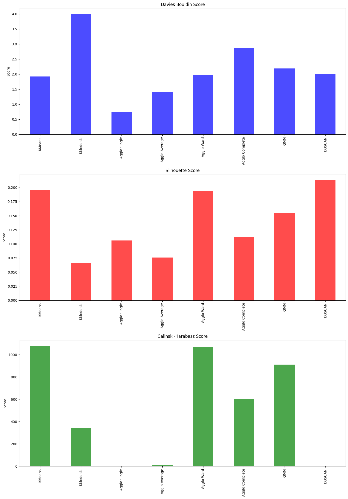

## Feedback - modelowanie
+ wizualizja klastrów, fajnie gdyby w prezentacji chociaż była
+ analiza czym się różnią klastry, czym się model kieruje
+ wyniki podobne, jedynie trochę inne wykresy porównujące w AgglomerativeClustering, jednak nie wpłyneło to na ostateczny wybór, więc dobra robota

